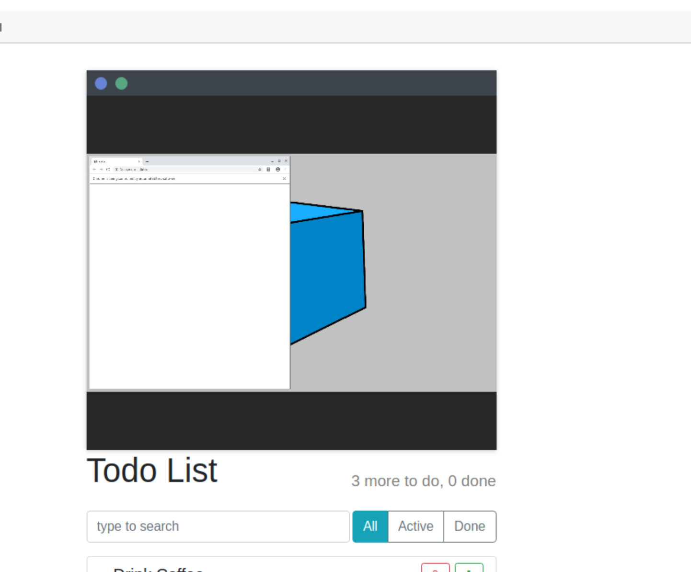

# frame-vnc-selenoid
### vnc окно в реакт приложеннии
  
 vnc window websocket selenoid

### Установка
```sh
npm install
```

### Настройка
src\components\VncCard\VncScreen.js
```js
createRFB(link, port, session, secure) {
        let hostn = `${link.hostname}`
        hostn = '172.31.50.74'
        port = '4444'
        session = '0aed1c282da51632f51e9da9e6666bf6'
        const rfb = new RFB(this.canvas, `${secure ? "wss" : "ws"}://${hostn}:${port}/vnc/${session}`, {
        //const rfb = new RFB(this.canvas, `${secure ? "wss" : "ws"}://${hostn}:${port}/ws/vnc/${session}`, {
        //const rfb = new RFB(this.canvas, 'ws://localhost:4444/vnc/eb65afc264c6a66a7b8482d2868e4256', {
            credentials: {
                password: "selenoid",
            },
        });
```

### Запуск
```sh
npm start
```
